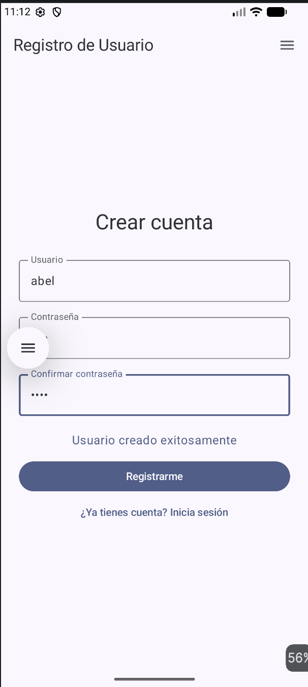
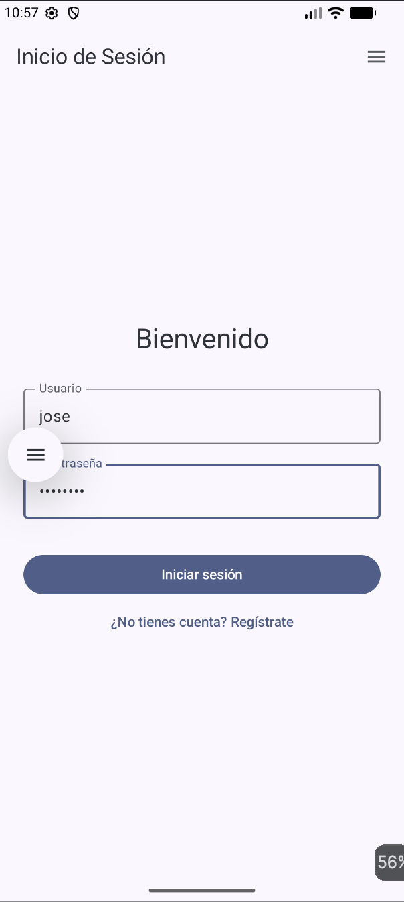
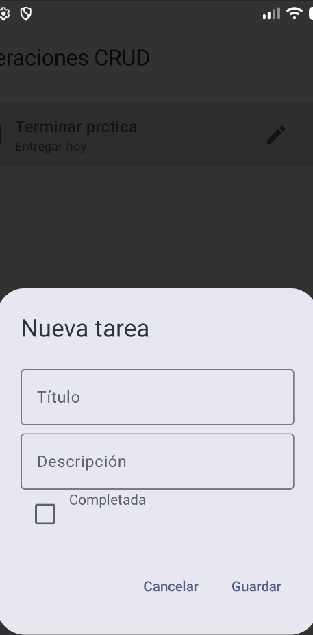
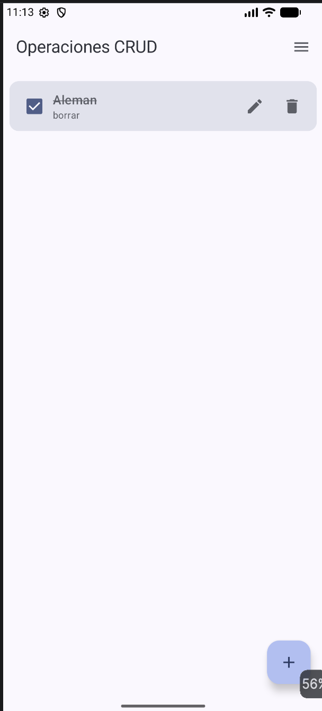
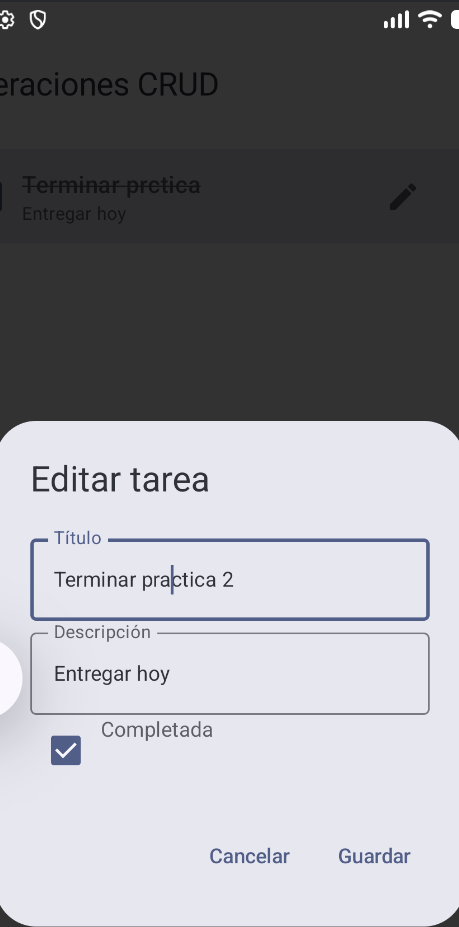
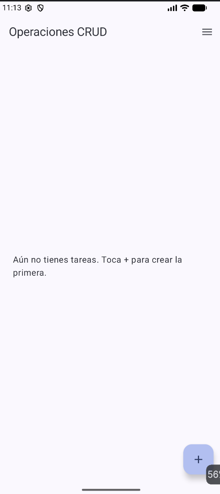
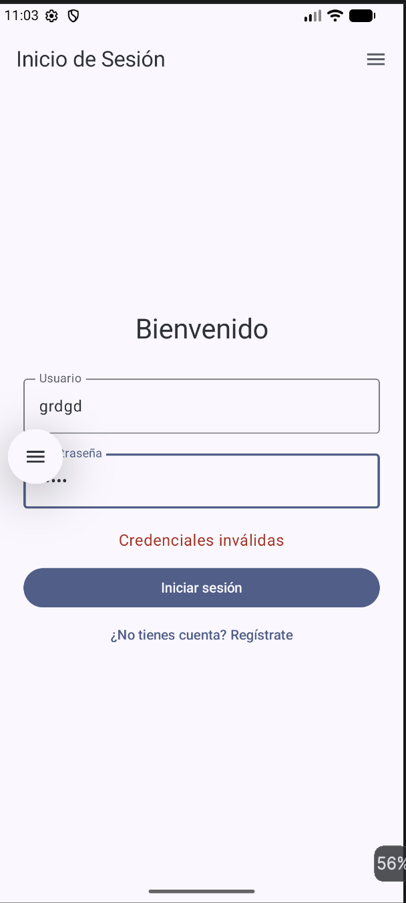

# Práctica 2 – App móvil con autenticación segura y operaciones CRUD

## Portada

- **Institución:** Instituto Politécnico Nacional – Escuela Superior de Cómputo (ESCOM)
- **Materia:** Desarrollo de Aplicaciones Móviles Nativas
- **Profesor:** Hurtado Áviles Gabriel
- **Alumno:** Reyes Castellanos José Abel
- **Boleta:** 2020311353
- **Grupo:** 7CV4
- **Fecha:** 18 de septiembre de 2026

---

## Introducción

El objetivo de esta práctica es construir una aplicación móvil nativa para Android (usando **Kotlin** y **Jetpack Compose**) que consuma una API REST propia para realizar operaciones **CRUD** (Crear, Leer, Actualizar y Eliminar) sobre un recurso, e implementar un mecanismo de **autenticación segura** de usuarios (registro e inicio de sesión), de modo que solo un usuario autenticado pueda ver y manipular sus propios datos.

Para el backend se usó **Flask** (Python) junto con **Flask-SQLAlchemy** como ORM sobre una base de datos **SQLite**, empaquetado y ejecutado dentro de un contenedor de **Docker**. Como punto de partida se tomó el repositorio de ejemplo del profesor [`gabrielhuav/Flask-Compose-Login-API`](https://github.com/gabrielhuav/Flask-Compose-Login-API), que ya incluía el registro/login básico de usuarios con contraseñas hasheadas; a partir de ahí se agregaron: autenticación basada en **tokens (JWT)**, el modelo y las rutas CRUD del recurso `Task` (tareas), y toda la aplicación Android que consume esa API.

Se eligió esta arquitectura porque:

- **Docker** permite que el backend se ejecute igual en cualquier máquina, sin tener que instalar Python ni sus dependencias manualmente.
- **Flask** es un microframework sencillo y muy usado para exponer APIs REST rápidamente.
- **JWT (JSON Web Tokens)** permite manejar sesiones de forma *stateless* (el servidor no necesita guardar la sesión en memoria), lo cual es ideal para una API consumida por una app móvil.
- **Jetpack Compose** es el framework moderno recomendado por Google para construir interfaces en Android de forma declarativa, en lugar de usar XML y Activities/Fragments clásicos.

---

## Desarrollo

### 1. Conceptos clave (explicados con mis propias palabras)

**Docker, imagen y contenedor.** Docker es una herramienta que empaqueta una aplicación junto con todo lo que necesita para funcionar (el intérprete de Python, las librerías, el código, etc.) en un solo paquete llamado **imagen**. Cuando esa imagen se ejecuta, se convierte en un **contenedor**: un proceso aislado que corre como si tuviera su propio sistema operativo, pero en realidad comparte el kernel de la máquina anfitriona. Esto evita el clásico problema de "en mi máquina sí funciona" porque el contenedor siempre trae exactamente las mismas versiones de todo.

**Dockerfile.** Es un archivo de texto con instrucciones paso a paso de cómo construir la imagen: de qué imagen base partir (en este proyecto, una imagen de Python), qué archivos copiar dentro del contenedor, qué dependencias instalar (`pip install -r requirements.txt`) y qué comando ejecutar al iniciar (`python app.py`).

**docker-compose.yml.** Cuando un proyecto necesita uno o varios contenedores trabajando juntos (por ejemplo, un backend y una base de datos separada), Docker Compose permite describir todos esos "servicios" en un solo archivo YAML y levantarlos con un solo comando (`docker compose up`). En este proyecto solo hay un servicio (`web`, el backend Flask), y el archivo también define el mapeo de puertos entre la máquina y el contenedor, y las variables de entorno.

**Backend / API REST.** El backend es el programa que corre "detrás" de la app y que contiene toda la lógica de negocio y el acceso a los datos. Una **API REST** es la forma en que ese backend expone sus funciones a través de internet (HTTP), usando rutas (URLs) y verbos HTTP (`GET`, `POST`, `PUT`, `DELETE`) para representar acciones sobre "recursos" (en este caso, usuarios y tareas). El backend responde con datos en formato **JSON**, que es fácil de leer tanto para humanos como para programas.

**ORM y base de datos.** Un ORM (*Object-Relational Mapper*) es una capa que traduce entre objetos de un lenguaje de programación (clases de Python) y las tablas de una base de datos relacional, para no tener que escribir SQL a mano. Aquí se usa **Flask-SQLAlchemy**, y cada clase de Python (`User`, `Task`) representa una tabla de la base de datos **SQLite** (un motor de base de datos ligero que guarda todo en un solo archivo, `site.db`).

**Autenticación con contraseñas hasheadas.** Nunca se debe guardar la contraseña de un usuario en texto plano en la base de datos, porque si alguien accede a ella podría robar todas las contraseñas. Por eso se usa **hashing** (con `Flask-Bcrypt`): una función matemática de un solo sentido que convierte la contraseña en una cadena de caracteres irreconocible, y que además agrega un "salt" aleatorio para que dos contraseñas iguales no generen el mismo hash. Al iniciar sesión, se vuelve a aplicar la función al password ingresado y se compara el resultado contra el hash guardado, sin necesidad de "desencriptar" nada.

**Sesión segura basada en tokens (JWT).** En lugar de usar cookies de sesión tradicionales, esta API genera un **JSON Web Token** al iniciar sesión correctamente. El token es una cadena firmada digitalmente con una llave secreta del servidor (`SECRET_KEY`) que contiene el id del usuario y una fecha de expiración. La app Android guarda ese token de forma local y lo envía en cada petición protegida dentro del header `Authorization: Bearer <token>`. El servidor valida la firma y la expiración del token en cada petición (decorador `token_required`), y si es válido, sabe exactamente qué usuario está haciendo la petición, sin tener que guardar nada de sesión en el servidor.

### 2. Endpoints de la API

Backend base (dentro de Docker): `http://localhost:5001` &nbsp;|&nbsp; Desde el emulador de Android: `http://10.0.2.2:5001`

| Método | Ruta | Protegido | Descripción |
|---|---|---|---|
| GET | `/` | No | Verifica que la API esté funcionando |
| POST | `/register` | No | Crea un nuevo usuario |
| POST | `/login` | No | Inicia sesión y devuelve un token JWT |
| GET | `/tasks` | Sí | Lista todas las tareas del usuario autenticado |
| GET | `/tasks/<id>` | Sí | Obtiene una tarea específica del usuario |
| POST | `/tasks` | Sí | Crea una nueva tarea para el usuario autenticado |
| PUT | `/tasks/<id>` | Sí | Actualiza una tarea existente del usuario |
| DELETE | `/tasks/<id>` | Sí | Elimina una tarea del usuario |

Las rutas marcadas como protegidas requieren el header:

```
Authorization: Bearer <token>
```

#### POST /register

Request:
```json
{
  "username": "android_dev",
  "password": "mi_password_secreto"
}
```
Response `201 Created`:
```json
{ "message": "Usuario creado exitosamente" }
```

#### POST /login

Request:
```json
{
  "username": "android_dev",
  "password": "mi_password_secreto"
}
```
Response `200 OK`:
```json
{
  "status": "success",
  "message": "Login exitoso",
  "user_id": 1,
  "username": "android_dev",
  "token": "eyJhbGciOiJIUzI1NiIsInR5cCI6IkpXVCJ9..."
}
```
Response `401 Unauthorized` (credenciales incorrectas):
```json
{ "status": "error", "message": "Credenciales inválidas" }
```

#### GET /tasks

Response `200 OK`:
```json
[
  {
    "id": 3,
    "title": "Aleman",
    "description": "borrar",
    "completed": true,
    "user_id": 1,
    "created_at": "2026-09-18T11:13:02.123456+00:00"
  }
]
```

#### POST /tasks

Request:
```json
{
  "title": "Estudiar",
  "description": "Repasar Docker",
  "completed": false
}
```
Response `201 Created`: la tarea creada, con su `id` asignado.

#### PUT /tasks/<id>

Request (solo los campos que se quieran actualizar):
```json
{ "title": "Terminar practica 2", "completed": true }
```
Response `200 OK`: la tarea ya actualizada.

#### DELETE /tasks/<id>

Response `200 OK`:
```json
{ "message": "Tarea eliminada" }
```

### 3. Instalación y ejecución

#### Backend (Flask + Docker)

Requisitos: tener **Docker Desktop** instalado y corriendo.

```bash
cd Docker-Flask/ORM
cp .env.example .env      # y opcionalmente cambiar el valor de SECRET_KEY
docker compose up --build
```

Esto construye la imagen, instala las dependencias de `requirements.txt` y levanta el servidor Flask dentro del contenedor, publicado en `http://localhost:5001`.

> **Nota técnica:** el `docker-compose.yml` mapea el puerto **5001** de la máquina hacia el **5000** del contenedor (`"5001:5000"`) en lugar de usar 5000 en ambos lados, porque en macOS el puerto 5000 normalmente ya está ocupado por el servicio del sistema "AirPlay Receiver".

Se puede probar que el backend responde con los comandos de `Docker-Flask/ORM/curl.txt`, por ejemplo:

```bash
curl -X POST http://localhost:5001/register \
  -H "Content-Type: application/json" \
  -d '{"username":"android_dev","password":"mi_password_secreto"}'
```

#### App Android (Kotlin + Jetpack Compose)

Requisitos: **Android Studio**, con un emulador de Android configurado (o un dispositivo físico).

1. Abrir la carpeta `Android/FlaskLogin` como proyecto en Android Studio.
2. Esperar a que termine la sincronización de Gradle.
3. Con el backend ya corriendo (paso anterior), ejecutar la app (▶) sobre un emulador.
4. La app se conecta automáticamente a `http://10.0.2.2:5001`, la dirección especial que usa el emulador de Android para llegar al backend que corre en la misma computadora (host).

Desde la app se puede: registrar un usuario nuevo, iniciar sesión, y una vez dentro, crear, ver, editar y eliminar tareas (operaciones CRUD), todas asociadas únicamente al usuario que inició sesión.

### 4. Capturas de pantalla

**Registro de usuario**



**Inicio de sesión**



**Crear tarea (Create)**



**Listar tareas (Read)**



**Editar tarea (Update)**



**Eliminar tarea (Delete)**



**Manejo de error: credenciales inválidas**



---

## Conclusiones

Durante el desarrollo de esta práctica se reforzaron varios conceptos que antes solo conocía de forma teórica, como la diferencia entre guardar una contraseña "encriptada" y guardarla con un hash irreversible, o por qué un token JWT es una alternativa más adecuada que las sesiones tradicionales para una API consumida por una app móvil.

También se presentaron algunos problemas reales durante la implementación que tuvieron que resolverse:

- Al levantar el contenedor con `docker compose up`, macOS mostró el error *"ports are not available: exposing port TCP 0.0.0.0:5000 ... bind: address already in use"*. Se diagnosticó que el puerto 5000 estaba siendo usado por el servicio "AirPlay Receiver" del propio sistema operativo, y se solucionó cambiando el mapeo de puertos en `docker-compose.yml` a `5001:5000`, actualizando también la URL base de la app Android (`10.0.2.2:5001`).
- Flask-SQLAlchemy mostró una advertencia de API obsoleta (*LegacyAPIWarning*) al usar `User.query.get(id)`; se corrigió usando la forma recomendada `db.session.get(User, id)`.
- Al ser Android quien consume la API, fue necesario recordar que dentro del emulador `localhost` apunta al propio emulador y no a la computadora anfitriona, por lo que hay que usar la dirección especial `10.0.2.2`.

En general, el ejercicio permitió integrar, en un solo proyecto, un backend contenerizado con autenticación segura y una aplicación móvil nativa que lo consume de principio a fin, cubriendo el ciclo completo de una operación CRUD real.

---

## Bibliografía (formato APA)

Grinberg, M. (2018). *Flask web development: Developing web applications with Python* (2.ª ed.). O'Reilly Media.

Docker Inc. (s.f.). *Docker overview*. Docker Docs. Recuperado el 18 de septiembre de 2026, de https://docs.docker.com/get-started/overview/

Docker Inc. (s.f.). *Compose file reference*. Docker Docs. Recuperado el 18 de septiembre de 2026, de https://docs.docker.com/compose/compose-file/

Pallets Projects. (s.f.). *Flask documentation*. Recuperado el 18 de septiembre de 2026, de https://flask.palletsprojects.com/

SQLAlchemy authors. (s.f.). *Flask-SQLAlchemy documentation*. Recuperado el 18 de septiembre de 2026, de https://flask-sqlalchemy.palletsprojects.com/

Jones, M. B., Bradley, J., & Sakimura, N. (2015). *RFC 7519: JSON Web Token (JWT)*. Internet Engineering Task Force. https://www.rfc-editor.org/rfc/rfc7519

PyJWT contributors. (s.f.). *PyJWT documentation*. Recuperado el 18 de septiembre de 2026, de https://pyjwt.readthedocs.io/

Google. (s.f.). *Jetpack Compose*. Android Developers. Recuperado el 18 de septiembre de 2026, de https://developer.android.com/jetpack/compose

Google. (s.f.). *Guide to app architecture*. Android Developers. Recuperado el 18 de septiembre de 2026, de https://developer.android.com/topic/architecture

Square Inc. (s.f.). *Retrofit: A type-safe HTTP client for Android and Java*. Recuperado el 18 de septiembre de 2026, de https://square.github.io/retrofit/

Google. (s.f.). *DataStore*. Android Developers. Recuperado el 18 de septiembre de 2026, de https://developer.android.com/topic/libraries/architecture/datastore

Hurtado Áviles, G. (2026). *Flask-Compose-Login-API* [Repositorio base proporcionado por el profesor]. GitHub. https://github.com/gabrielhuav/Flask-Compose-Login-API
